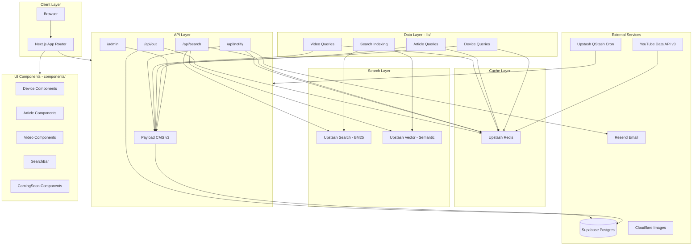

# FweezyTech

Kenya's #1 Tech Review Destination — honest, in-depth device reviews and comparisons.

Built with [Next.js](https://nextjs.org) 16.2.10, [Payload CMS](https://payloadcms.com) v3, Supabase Postgres, Upstash Redis/Search/Vector/QStash, and shadcn/ui.

---

## Architecture



## Endpoints

### Pages
| Route | Type | Description |
|-------|------|-------------|
| `/` | SSR | Homepage — top devices, videos, articles, coming-soon |
| `/devices` | SSR | Device catalogue with brand/category filters, pagination |
| `/devices/[brand]/[slug]` | SSG | Device detail — specs, scores, benchmarks, verdict, buy links |
| `/articles` | SSR | Article listing with category filters, pagination |
| `/articles/[slug]` | SSG | Full article with rich text, breadcrumb, JSON-LD |
| `/videos` | SSR | Multi-platform video feed with platform filter tabs |
| `/coming-soon` | SSR | Teaser cards with email notification form |
| `/search?q=` | SSR | Hybrid search results (BM25 + semantic vector) |
| `/admin/[[...segments]]` | SSR | Payload CMS admin panel |

### API Routes
| Route | Method | Description | Rate Limit |
|-------|--------|-------------|------------|
| `/api/search` | GET | Hybrid search (BM25 + vector), preview mode for autocomplete | 30 req/min |
| `/api/notify` | POST | Email capture for coming-soon notifications via Resend | 3 req/min |
| `/api/out/[device]/[retailer]` | GET | Affiliate redirect with click logging | 20 req/min |
| `/api/cron/keep-alive` | GET | QStash-triggered keep-alive pings | N/A |
| `/api/[...slug]` | all | Payload CMS REST API | N/A |

---

## Communities (Community Users)

| Route | Type | Description | Rate Limit |
|-------|------|-------------|------------|
| `/api/community/ratings` | GET/POST | Community ratings for a device | 60 / 5 req/min |
| `/api/community/ratings/vote` | POST | Vote on a rating (helpful / not helpful) | 20 req/min |
| `/api/community/comments` | GET/POST | Comments on articles/videos/devices | 60 / 3 req/min |
| `/api/community/comments/vote` | POST | Vote on a comment | 30 req/min |
| `/api/community/comments/report` | POST | Report a comment | 10 req/min |

## Compare Engine

| Route | Type | Description |
|-------|------|-------------|
| `/compare?devices=slug1,slug2` | SSR | Device comparison with radar chart, spec diff table, and verdict |
| `/api/og/compare?devices=...` | GET | OG image generation for social sharing of comparisons |

## SQL Migrations

Run these in order in the Supabase dashboard SQL editor:

1. `003_community_users.sql` — Community profiles table (mirrors Supabase Auth users)
2. `004_ratings.sql` — Device ratings, community score view, rating votes
3. `005_comments.sql` — Comments (threaded, 1 level deep), comment votes
4. `006_verified_owner.sql` — Affiliate click user linkage, verified owners view

## Supabase Auth Setup

1. Go to Supabase dashboard → Authentication → Providers
2. Enable Google:
   - Create OAuth credentials in Google Cloud Console
   - Authorised redirect URI: `{SUPABASE_URL}/auth/v1/callback`
   - Paste Client ID and Secret into Supabase dashboard
3. Enable Email (magic link):
   - Supabase enables this by default
   - Set "Confirm email" to ON
   - Set SMTP to Resend (Host: `smtp.resend.com`, Port: `465`, User: `resend`, Password: `{RESEND_API_KEY}`)
   - Sender name: `FweezyTech`, Sender email: `{RESEND_FROM_EMAIL}`
4. Site URL: `http://localhost:3000` (dev) / `https://fweezytech.com` (prod)
5. Redirect URLs whitelist:
   - `http://localhost:3000/auth/callback`
   - `https://fweezytech.com/auth/callback`

---

## File Tree

```
fweezytech/
├── .env.example                    # Environment template
├── .gitignore
├── components.json                 # shadcn/ui config
├── eslint.config.mjs
├── middleware.ts                   # Next.js middleware (Supabase session refresh)
├── next.config.ts
├── package.json
├── postcss.config.mjs
├── tsconfig.json
│
├── src/
│   ├── payload.config.ts           # Payload CMS — all collections
│   ├── payload-types.ts            # Generated Payload types
│   │
│   ├── app/                        # Next.js App Router
│   │   ├── layout.tsx              # Root layout (fonts, theme, header/footer, auth, tray)
│   │   ├── page.tsx                # Homepage
│   │   ├── robots.ts               # Robots.txt
│   │   ├── sitemap.ts              # Dynamic sitemap
│   │   │
│   │   ├── (payload)/admin/        # Payload CMS admin UI
│   │   │
│   │   ├── api/
│   │   │   ├── [...slug]/route.ts  # Payload REST API catch-all
│   │   │   ├── auth/callback/route.ts  # Supabase OAuth callback
│   │   │   ├── auth/error/page.tsx     # Auth error page
│   │   │   ├── cron/keep-alive/    # QStash cron
│   │   │   ├── notify/route.ts     # Email capture
│   │   │   ├── out/[device]/[retailer]/  # Affiliate redirect
│   │   │   ├── search/route.ts     # Hybrid search API
│   │   │   ├── og/compare/route.tsx     # OG image for comparisons
│   │   │   ├── community/          # Community features API
│   │   │   │   ├── ratings/route.ts
│   │   │   │   ├── ratings/vote/route.ts
│   │   │   │   ├── comments/route.ts
│   │   │   │   ├── comments/vote/route.ts
│   │   │   │   └── comments/report/route.ts
│   │   │
│   │   ├── articles/
│   │   │   ├── page.tsx            # Article listing
│   │   │   └── [slug]/page.tsx     # Article detail (SSG) + comments
│   │   │
│   │   ├── coming-soon/page.tsx    # Upcoming reviews
│   │   ├── compare/page.tsx        # Device comparison page
│   │   ├── devices/
│   │   │   ├── page.tsx            # Device catalogue
│   │   │   └── [brand]/[slug]/page.tsx  # Device detail (SSG) + ratings + comments
│   │   ├── search/page.tsx         # Search results
│   │   └── videos/
│   │       ├── page.tsx            # Video feed
│   │       └── video-feed.tsx      # Client-side feed logic
│   │
│   ├── components/
│   │   ├── articles/
│   │   │   ├── ArticleBody.tsx     # Lexical rich text renderer
│   │   │   └── ArticleCard.tsx     # Article card with category badge
│   │   ├── auth/
│   │   │   ├── AuthModal.tsx       # Google + Magic Link sign-in dialog
│   │   │   └── AuthButton.tsx      # Sign in / avatar dropdown
│   │   ├── community/
│   │   │   ├── RatingsSection.tsx  # Community ratings with submit form
│   │   │   ├── RatingCard.tsx      # Individual rating card
│   │   │   ├── CommentsSection.tsx # Threaded comments section
│   │   │   ├── CommentCard.tsx     # Individual comment card
│   │   │   ├── RatingsSkeleton.tsx # Skeleton loader for ratings
│   │   │   └── CommentsSkeleton.tsx # Skeleton loader for comments
│   │   ├── compare/
│   │   │   ├── ComparisonTray.tsx   # Floating bottom comparison tray
│   │   │   ├── CompareRadarChart.tsx # Multi-device overlay radar chart
│   │   │   ├── CompareSpecTable.tsx  # Side-by-side spec diff table
│   │   │   ├── CompareDevicePicker.tsx # Add/remove devices picker
│   │   │   ├── ShareComparisonButton.tsx # Copy link to clipboard
│   │   │   └── ComparePageSkeleton.tsx # Skeleton loader for compare page
│   │   ├── coming-soon/
│   │   │   ├── NotifyForm.tsx      # Email capture form
│   │   │   └── TeaserCard.tsx      # Blurred silhouette card
│   │   ├── devices/
│   │   │   ├── AddToCompareButton.tsx # Add device to comparison tray
│   │   │   ├── BenchmarkChart.tsx  # Animated benchmark bars
│   │   │   ├── BuyBox.tsx          # Retailer buttons
│   │   │   ├── DeviceCard.tsx      # Device card
│   │   │   ├── RadarChart.tsx      # SVG pentagon chart
│   │   │   ├── ScoreBadge.tsx      # Color-coded score badge
│   │   │   ├── SpecTable.tsx       # Collapsible spec sections
│   │   │   └── VerdictBlock.tsx    # Pros/cons/bottom line
│   │   ├── icons/SocialIcons.tsx
│   │   ├── layout/
│   │   │   ├── Footer.tsx
│   │   │   └── Header.tsx          # Nav + SearchBar + auth + theme toggle
│   │   ├── search/SearchBar.tsx    # Autocomplete search
│   │   ├── ui/                     # shadcn/ui primitives
│   │   └── videos/
│   │       ├── HeroCarousel.tsx    # Auto-rotating hero
│   │       ├── VideoCard.tsx       # Thumbnail + platform badge
│   │       └── VideoModal.tsx      # Full-screen video player
│   │
│   ├── context/
│   │   ├── AuthContext.tsx          # Supabase auth state provider
│   │   └── ComparisonTrayContext.tsx # Comparison tray state (sessionStorage)
│   │
│   ├── lib/
│   │   ├── utils.ts                # cn() helper
│   │   ├── auth/actions.ts         # Server actions for Supabase Auth
│   │   ├── community/
│   │   │   ├── ratings.ts          # Community ratings data layer
│   │   │   ├── comments.ts         # Community comments data layer
│   │   │   └── profanity.ts        # Simple profanity filter
│   │   ├── articles/queries.ts     # Article data access + Redis cache
│   │   ├── db/
│   │   │   ├── migrations/         # SQL migrations (003-006)
│   │   │   └── seed/               # Seed scripts
│   │   ├── devices/queries.ts      # Device data access + Redis cache
│   │   ├── search/indexing.ts      # Upstash indexing helpers
│   │   ├── supabase/               # Supabase client utils
│   │   ├── upstash/                # Redis, Search, Vector, QStash, Ratelimit
│   │   ├── videos/queries.ts       # Video + ComingSoon data access
│   │   └── youtube/client.ts       # YouTube Data API v3
│   │
│   ├── scripts/
│   │   ├── register-keepalive-cron.ts  # QStash cron registration
│   │   └── reindex-all.ts              # Upstash reindex
│   │
│   └── styles/globals.css          # Tailwind v4 + CSS variables
│
└── public/                         # Static assets
```

## Getting Started

```bash
git clone git@github.com:Godwin-88/congenial-fiesta.git
cd congenial-fiesta
cp .env.example .env.local   # Fill in credentials
npm install
npm run dev                   # → http://localhost:3000
```

## Key Scripts

| Command | Description |
|---------|-------------|
| `npm run dev` | Start development server |
| `npm run build` | Production build |
| `npm run db:seed` | Seed devices + brands into Payload CMS |
| `npm run db:seed:content` | Seed articles, videos, coming-soon |
| `npm run db:migrate` | Run Supabase community migrations (003-006) |
| `npm run search:reindex` | Reindex all content into Upstash Search + Vector |
| `npm run cron:register` | Register QStash keep-alive cron |

## Tech Stack

| Category | Technology |
|----------|------------|
| Framework | Next.js 16.2.10 (App Router, Turbopack) |
| CMS | Payload CMS v3 + Lexical editor |
| Database | Supabase Postgres (via Payload db-postgres adapter) |
| Cache | Upstash Redis |
| Full-Text Search | Upstash Search (BM25) |
| Semantic Search | Upstash Vector (auto-embedding) |
| Rate Limiting | Upstash Ratelimit |
| Cron Jobs | Upstash QStash |
| Video API | YouTube Data API v3 |
| Email | Resend |
| Styling | Tailwind CSS v4 + shadcn/ui + `@tailwindcss/typography` |
| Hosting | Vercel-ready |

## Environment Variables

```
# Supabase / Database
DATABASE_URL=              # Postgres connection string
NEXT_PUBLIC_SUPABASE_URL=
NEXT_PUBLIC_SUPABASE_ANON_KEY=
SUPABASE_SERVICE_ROLE_KEY=
SUPABASE_AUTH_CALLBACK_URL=http://localhost:3000/auth/callback

# Payload CMS
PAYLOAD_SECRET=            # Random secret for auth
NEXT_PUBLIC_SERVER_URL=    # http://localhost:3000 or production URL

# Upstash
UPSTASH_REDIS_REST_URL=    # Redis for caching + ratelimit
UPSTASH_REDIS_REST_TOKEN=
UPSTASH_SEARCH_REST_URL=   # BM25 full-text search
UPSTASH_SEARCH_REST_TOKEN=
UPSTASH_VECTOR_REST_URL=   # Semantic search
UPSTASH_VECTOR_REST_TOKEN=
UPSTASH_VECTOR_EMBEDDING_MODEL=auto  # 'auto' or 'openai'
QSTASH_TOKEN=              # Cron scheduling

# YouTube
YOUTUBE_API_KEY=           # YouTube Data API v3 key
YOUTUBE_CHANNEL_ID=        # FweezyTech channel ID

# Email
RESEND_API_KEY=
RESEND_FROM_EMAIL=hello@fweezytech.com

# Cloudflare Images
CLOUDFLARE_IMAGES_ACCOUNT_ID=
CLOUDFLARE_IMAGES_API_TOKEN=
```

## Collections (Payload CMS)

| Collection | Slug | Key Fields |
|------------|------|------------|
| Brands | `brands` | name, slug, logo, featured |
| Devices | `devices` | name, slug, brand, category, scores, specs (7 groups), benchmarks, buyLinks, verdict |
| Articles | `articles` | title, slug, excerpt, body (richText), category, status, readingTimeMinutes |
| Videos | `videos` | title, platform (youtube/tiktok/ig/fb), embedId, viewCount, featured |
| Coming Soon | `coming-soon` | deviceName, expectedWeek, teaser, notifyEmails, notifyCount |
| Users | `users` | email, password, role (admin/editor/viewer) |
| Media | `media` | Uploaded images |

## Search Architecture

Search uses a **hybrid approach** — both BM25 full-text and semantic vector search run in parallel for every query:

```
User Query
    │
    ├─→ Upstash Search (BM25) ──→ Exact/fuzzy text matches
    │
    ├─→ Upstash Vector ──────────→ Semantic similarity (auto-embedded)
    │
    └─→ Merge + Deduplicate ────→ Sorted results (cap 20)
```

- **Upstash Search** indexes content with metadata (type, title, url, image, brand, category, score)
- **Upstash Vector** stores embeddings for semantic "meaning" matching
- Both indexes are updated automatically via Payload `afterChange` / `afterDelete` hooks
- YouTube API calls are cached in Redis for 6 hours
- All other queries are cached with 5-10 minute TTLs

## M4 Progress — Comparison Engine + Community

### Deliverables Checklist

| # | Item | Status |
|---|------|--------|
| 1 | Full device comparison engine (`/compare`) | ✅ Complete |
| 2 | Radar chart overlay (multi-device spider chart) | ✅ Complete |
| 3 | Spec diff table with highlights + "show only differences" | ✅ Complete |
| 4 | Shareable comparison URLs + floating comparison tray | ✅ Complete |
| 5 | OG image generation for `/compare` (`/api/og/compare`) | ✅ Complete |
| 6 | Supabase Auth — Google OAuth + magic link | ✅ Complete |
| 7 | Auth callback (`/auth/callback`) | ✅ Complete |
| 8 | Auth error page (`/auth/error`) | ✅ Complete |
| 9 | `AuthModal` (Google + Magic Link tabs) | ✅ Complete |
| 10 | `AuthButton` (sign in / avatar dropdown) | ✅ Complete |
| 11 | `AuthContext` provider wrapping app | ✅ Complete |
| 12 | `ComparisonTrayContext` with sessionStorage persistence | ✅ Complete |
| 13 | `ComparisonTray` floating bottom bar | ✅ Complete |
| 14 | `AddToCompareButton` on `DeviceCard` | ✅ Complete |
| 15 | User ratings + community reviews on device pages | ✅ Complete |
| 16 | Verified Owner badge (affiliate click → review linkage) | ✅ Complete |
| 17 | Comments system (threaded, 1 level deep) on articles/videos/devices | ✅ Complete |
| 18 | Profanity filter at API level | ✅ Complete |
| 19 | Upstash Redis rate limiting on all community routes | ✅ Complete |
| 20 | `device_ratings`, `rating_votes`, `comments`, `comment_votes` tables | ✅ Complete |
| 21 | `community_profiles` table (mirrors Supabase Auth users) | ✅ Complete |
| 22 | `affiliate_clicks.user_id` linkage + `verified_device_owners` view | ✅ Complete |
| 23 | RBAC separation: Payload CMS admin vs Supabase community users | ✅ Complete |
| 24 | Creator badge (`FWEEZYTECH_CREATOR_USER_ID`) | ✅ Complete |
| 25 | `npm run build` passes | ⏳ Pending final verification |
| 26 | `npx tsc --noEmit` passes | ⏳ Pending final verification |

### Supabase Auth Setup

1. Go to Supabase dashboard → Authentication → Providers
2. Enable Google:
   - Create OAuth credentials in Google Cloud Console
   - Authorised redirect URI: `{SUPABASE_URL}/auth/v1/callback`
   - Paste Client ID and Secret into Supabase dashboard
3. Enable Email (magic link):
   - Supabase enables this by default
   - Set "Confirm email" to ON
   - Set SMTP to Resend (Host: `smtp.resend.com`, Port: `465`, User: `resend`, Password: `{RESEND_API_KEY}`)
   - Sender name: `FweezyTech`, Sender email: `{RESEND_FROM_EMAIL}`
4. Site URL: `http://localhost:3000` (dev) / `https://fweezytech.com` (prod)
5. Redirect URLs whitelist:
   - `http://localhost:3000/auth/callback`
   - `https://fweezytech.com/auth/callback`

---

## File Tree